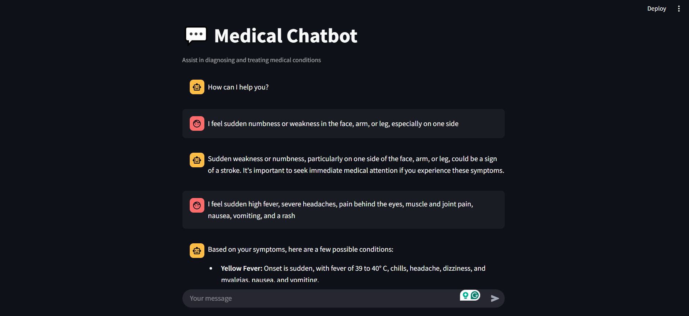

# 🏥 Medical RAG  
*A Retrieval-Augmented Generation (RAG) system for diagnosing and treating medical conditions*  

## 📝 Overview  
**Medical RAG** is an AI-powered system designed to assist in diagnosing and treating medical conditions. It leverages unstructured medical data, such as medical textbooks, to provide accurate and relevant responses using **hybrid search** (a mix of lexical and semantic search).  

The system enhances a general LLM with **optimal prompt engineering and data augmentation**, making it more **specific and domain-oriented**. It employs **fine-tuned vector search** to retrieve information from a vector database, ensuring high-quality medical assistance.  

## 🚀 Features  
✅ Hybrid search (lexical + semantic) for enhanced retrieval  
✅ Domain-specific tuning through data augmentation  
✅ Fine-tuned vector search for accurate medical responses  
✅ Streamlit-based user interface for easy interaction  

## 🛠️ Tech Stack  
- **AI & NLP:** Sentence-Transformers, Google Generative AI  
- **Vector Search:** Pinecone  
- **Backend:** Python  
- **Frontend:** Streamlit  
- **Dependency Management:** Poetry  

## 📸 UI Preview  


## 🔧 Installation & Setup  
### Prerequisites  
- Python 3.x  
- Poetry  

### Steps  
1. Clone the repository:  
   ```bash
   git clone https://github.com/your-username/medical-rag.git
   cd medical-rag
   ```  
2. Install dependencies using Poetry:  
   ```bash
   poetry install
   ```  
3. Create a `.env` file for API keys and configuration.  
4. Run the application:  
   ```bash
   poetry run streamlit run app.py
   ```  

## 📦 Dependencies  
This project uses **Poetry** for dependency management. The required packages are:  
```toml
[tool.poetry.dependencies]
sentence-transformers = ">=3.4.1,<4.0.0"
pinecone-text = ">=0.10.0,<0.11.0"
pinecone = {extras = ["grpc"], version = ">=6.0.2,<7.0.0"}
dotenv = ">=0.9.9,<0.10.0"
google-genai = ">=1.7.0,<2.0.0"
streamlit = ">=1.43.2,<2.0.0"
```  

## 🤝 Contributing  
Feel free to contribute by opening issues and pull requests. Follow the standard GitHub workflow:  
1. Fork the repository  
2. Create a feature branch (`git checkout -b feature-name`)  
3. Commit your changes (`git commit -m "Add new feature"`)  
4. Push to your branch (`git push origin feature-name`)  
5. Open a pull request  

## 📜 License  
This project is licensed under the MIT License - see the https://github.com/1tsZaid/LICENSE file for details.

## 📞 Contact  
- **GitHub:** https://github.com/1tsZaid 
- **Email:** zaidasif011@example.com  
